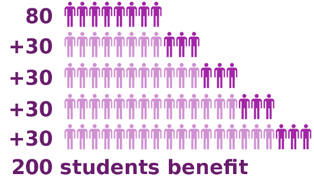
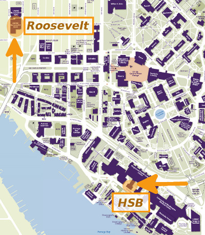

## Replace lab computers and monitors

<div class="columns-2">

<div style="text-align:center" markdown="1">

</div>

* Replace 14 PCs and monitors
* Total cost: $19,950
* Two student computer labs
* Used by 80 students in each year
* Academic and research work
* Equipment purchased in 2010
* Memory upgraded in 2013

</div>

## 200 students to benefit over 5 years

- We currently have 80 graduate students in our department. 
- Plus, we gain about 30 new students each year. 
- So, over the five-year expected life of these PCs ...
- We expect 200 students to use and benefit from these PCs.

<div style="text-align:center" markdown="1">

</div>

## Specialized software -- ideal workspace

These are the main reasons why the students value the computer labs:

- Productive, efficient, and collaborative workspace
- Less interference (noise, distractions) than in library
- More complete office (bigger screen, better PC, printing)
- Specialized software (Oracle Crystal Ball, Graphpad Prism)
- Only workspace (before adviser has been selected)
- Internet connection is fast and reliable
- Close proximity to department spaces

These benefits were summarized from feedback provided through 

- a *_recent survey_* with 40 responses
- over 40 student and faculty *_endorsements_*.

## Located near department spaces

<div style="text-align:center" markdown="1">

</div>

## Use increases throughout school year

```{r install_packages, message=FALSE, echo=FALSE}
# Install packages (if necessary)
pkgs <- c("knitr", "lubridate", "plyr", "dplyr", "pander", "ggplot2")
for (pkg in pkgs) {
    if (! suppressWarnings(require(pkg, character.only=TRUE)) ) {
        install.packages(pkg, repos="http://cran.fhcrc.org", dependencies=TRUE)
        if (! suppressWarnings(require(pkg, character.only=TRUE)) ) {
            stop(paste0(c("Can't load package: ", pkg, "!"), collapse = ""))
        }
    }
}
```

```{r set_options, message=FALSE, echo=FALSE}
# Configure `knitr` options.
opts_chunk$set(tidy=FALSE, cache=FALSE, message=FALSE, echo=FALSE)
```

```{r load_data}
# Load data
logins <- read.csv("logins.csv", header=T, stringsAsFactors=F)
logins$datetime <- ymd_hms(logins$datetime)
names(logins) <- c("datetime", "Location")
```

For our lab PCs, we average about one login per day, per PC, during the
academic year (Fall, Winter, and Spring).

<div class="columns-2">

```{r remove_extra}
# Subset data for location (student labs) and timespan (past year)
lab.logins <- logins[logins$Location != "HAL",]
lab.logins$date <- as.Date(lab.logins$datetime)
startdate <- "2015-02-01"
enddate <- "2016-01-31"
timespan <- paste(startdate, "through", enddate)
lab.logins <- subset(lab.logins, date >= startdate & date <= enddate)
lab.logins <- lab.logins[order(lab.logins$datetime , decreasing = TRUE ),]
```

```{r quarterly_hist, message=FALSE}
# Group by lab location and quarter
lab.logins$ID <- 1:nrow(lab.logins)
lab.logins$Location <- factor(lab.logins$Location)
lab.logins %>% mutate(Quarter=factor(quarter(datetime), 
                  levels=c(4, 1, 2, 3))) %>% 
    arrange(Quarter) %>% group_by(Location, Quarter) %>% 
    dplyr::summarize(Logins=n_distinct(ID)) -> lab.quarterly
lab.quarterly$Quarter <- revalue(lab.quarterly$Quarter,
                             c("4"="Fall",
                               "1"="Winter",
                               "2"="Spring",
                               "3"="Summer"))

# Define a custom theme
mytheme <- theme(plot.title = element_text(vjust=2), 
                 axis.text=element_text(size=10), 
                 axis.title.y=element_text(vjust=1.2),
                 axis.title.x=element_text(vjust=-.7))

# Plot quarterly lab logins
ggplot(data=lab.quarterly, aes(x=Quarter, y=Logins, fill=Location)) + 
    scale_fill_manual(values=c("#9999CC", "#66CC99")) +
    geom_bar(stat="identity") + 
    ggtitle(paste("Quarterly Lab Logins", "\n", timespan)) + 
    labs(x="Quarter", y="Logins") + theme_bw() + mytheme
```
```{r quarterly_hist_dev_off, echo=F, results='hide'}
dev.off()
```

```{r quarterly_table, results='asis'}
# Group by quarter
lab.logins %>% mutate(Quarter=factor(quarter(datetime), 
                  levels=c(4, 1, 2, 3))) %>% 
    arrange(Quarter) %>% group_by(Quarter) %>% 
    dplyr::summarize(Logins=n_distinct(ID)) -> lab.quarterly

# Show a table of quarterly logins
lab.quarterly$Quarter <- revalue(lab.quarterly$Quarter,
                             c("4"="Fall",
                               "1"="Winter",
                               "2"="Spring",
                               "3"="Summer"))
lab.quarterly %>% pandoc.table(style='rmarkdown')
```

<div class="small-centered">
The mean quarterly login count is _`r round(mean(lab.quarterly$Logins), 0)`_.
</div>

</div>

Usage increases throughout the academic year as students become more dependent 
upon the computer labs for their work.

<!-- THIS SLIDE HAS BEEN COMMENTED OUT AS BEING NOT PARTICULARLY RELEVANT ...

## Lab and server usage are comparable

We see a greater number of total logins on the student server (HAL). However, 
both the server and the computer lab follow the same usage trends.

<div class="columns-2">

```{r lab_logins_remove_extra}
# Subset by date
logins$date <- as.Date(logins$datetime)
startdate <- "2015-09-01"
enddate <- "2016-01-31"
timespan <- paste(startdate, "through", enddate)
logins <- subset(logins, date >= startdate & date <= enddate)
logins <- logins[order(logins$datetime , decreasing = TRUE ),]
```

```{r lab_mon_table, message=FALSE, results='asis'}
# Show a table of monthly logins
lab.logins <- logins[logins$Location != "HAL",]
lab.logins$ID <- 1:nrow(lab.logins)
lab.logins$Location <- factor(lab.logins$Location)
lab.logins %>% mutate(Month=factor(months(datetime, abbreviate=T), 
                  levels=c("Sep","Oct","Nov", "Dec", "Jan"))) %>% 
    arrange(Month) %>% group_by(Location, Month) %>% 
    dplyr::summarize(Logins=n_distinct(datetime)) -> lab.monthly
```

```{r lab_monthly_hist, message=FALSE}
ggplot(data=lab.monthly, aes(x=Month, y=Logins, fill=Location)) + 
    scale_fill_manual(values=c("#9999CC", "#66CC99")) +
    geom_bar(stat="identity") + 
    ggtitle(paste("Monthly Lab Logins", "\n", timespan)) + 
    labs(x="Month", y="Logins") + theme_bw() + mytheme
```
```{r lab_monthly_hist_dev_off, echo=F, results='hide'}
dev.off()
```

```{r mon_table, message=FALSE, results='asis'}
logins %>% mutate(Month=factor(months(datetime, abbreviate=T), 
                  levels=c("Sep","Oct","Nov", "Dec", "Jan"))) %>% 
    arrange(Month) %>% group_by(Location, Month) %>% 
    dplyr::summarize(Logins=n_distinct(datetime)) -> monthly
```

```{r monthly_hist, message=FALSE}
ggplot(data=monthly, aes(x=Month, y=Logins, fill=Location)) + 
    scale_fill_manual(values=c("#CC6666", "#9999CC", "#66CC99")) +
    geom_bar(stat="identity") + 
    ggtitle(paste("Monthly Logins", "\n", timespan)) + 
    labs(x="Month", y="Logins") + theme_bw() + mytheme
```
```{r monthly_hist_dev_off, echo=F, results='hide'}
dev.off()
```

</div>

Students rely upon both the server and the lab workstations to study 
and get their work done.

-->

## Students prefer lab when on campus

Lab use greatly exceeds server use during the morning and early afternoon.

```{r hourly_table, message=FALSE, results='asis'}
logins %>% mutate(Hour=factor(as.numeric(format(logins$datetime, "%H")))) %>% 
    arrange(Hour) %>% group_by(Location, Hour) %>% 
    dplyr::summarize(Logins=n_distinct(datetime)) -> hourly
```

```{r hourly_hist, message=FALSE, fig.width=8, fig.height=4}
ggplot(data=hourly, aes(x=Hour, y=Logins, fill=Location)) + 
    scale_fill_manual(values=c("#CC6666", "#9999CC", "#66CC99")) +
    geom_bar(stat="identity") + 
    ggtitle(paste("Hourly Logins", "\n", timespan)) + 
    labs(x="Hour of the Day", y="Logins") + theme_bw() + mytheme
```
```{r hourly_hist_dev_off, echo=F, results='hide'}
dev.off()
```

Students prefer lab PCs over the server for performance and ease-of-use.

## Funding this proposal will help ...

- Replace 14 lab computers and monitors
- Benefit 200 students
- Support a valuable student computing environment

