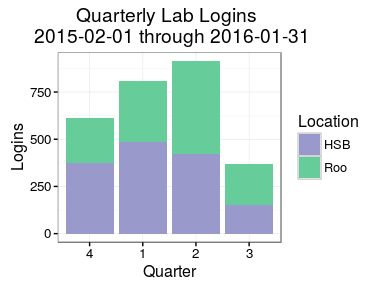
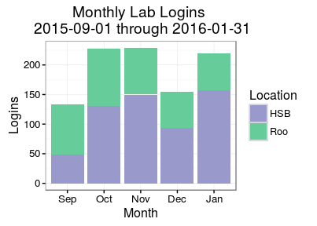
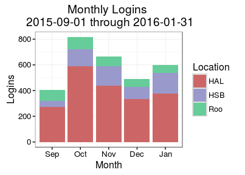

# Lab PC Replacement (#24)
Department of Environmental and Occupational Health Sciences (DEOHS)  
February 22, 2016  

## Proposal Summary

* Replace 14 PCs and monitors
* For a total cost of $19,950
* In two graduate student computer labs
* Used by 80 graduate students in each year
* For daily academic and research work

## How many students benefit?

We currently have 80 graduate students in our department. We have X new 
students each year. So, over the five-year expected life of these PCs, we 
expect Y students to use and benefit from these PCs.

## How do students benefit?

These are the main reasons why the students value the computer labs:

- Productive, efficient, and collaborative workspace
- Less interference (noise, distractions) than in library
- More complete office (bigger screen, better PC, printing)
- Special software (Oracle Crystal Ball, Graphpad Prism)
- Only workspace (before adviser has been selected)
- Internet connection is fast and reliable

These benefits were summarized from feedback provided through a *_recent survey_*.

## Quarterly Lab Logins

For our lab PCs, we average about one login per day, per PC, during the
academic year (Fall, Winter, and Spring).

\

|  Quarter  |  Logins  |
|:---------:|:--------:|
|   Fall    |   612    |
|  Winter   |   811    |
|  Spring   |   915    |
|  Summer   |   369    |

The mean quarterly login count is _677_.

Usage increases throughout the academic year as students become more dependent 
upon the computer labs for their work.

## Lab Logins, Compared with Server

We see a greater number of total logins on the student server (HAL). However, 
both the server and the computer lab follow the same usage trends.

\

\

Students rely upon both the server and the lab workstations to study 
and get their work done.
