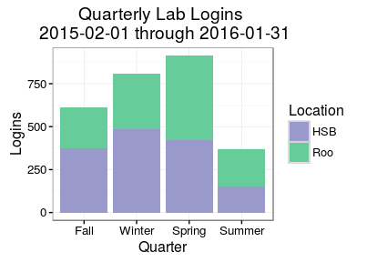

# Lab PC Replacement (#24)
Department of Environmental and Occupational Health Sciences (DEOHS)  
February 22, 2016  

## Proposal Summary

* Replace 14 PCs and monitors
* For a total cost of $19,950
* In two graduate student computer labs
* Used by 80 graduate students in each year
* For daily academic and research work

## How many students benefit?

We currently have 80 graduate students in our department. We have X new 
students each year. So, over the five-year expected life of these PCs, we 
expect Y students to use and benefit from these PCs.

## Quarterly Lab Logins

For our lab PCs, we average about one login per day, per PC, during the
academic year (Fall, Winter, and Spring).

\

|  Quarter  |  Logins  |
|:---------:|:--------:|
|   Fall    |   612    |
|  Winter   |   811    |
|  Spring   |   915    |
|  Summer   |   369    |

The mean quarterly login count is _677_.

Usage increases throughout the academic year as students become more dependent 
upon the computer labs for their work.

## Lab Logins, Compared with Server

We see a greater number of total logins on the student server (HAL). However, 
both the server and the computer lab follow the same usage trends.

\

\

Students rely upon both the server and the lab workstations to study 
and get their work done.

## What if this proposal is not funded?

While all of our graduate students log into the server as part of 
orientation, they still make heavy use of the labs throughout the year.

Therefore, the server cannot take the place of the lab PCs, but can only
provide an alternative for those who are able to work remotely.

So, if the proposal is not funded, we will have to keep using the old PCs.

As the PCs are failing and are off-warranty, the number of usable PCs will
decrease as they continue to age and fail.

Students would find the remaining PCs occupied when they come to the lab 
and would have to go elsewhere to study and work.

Students have stated their preference for using our computer labs and what they 
would stand to lose.

## How do students benefit?

These are the main reasons why the students value the computer labs:

- Productive, efficient, and collaborative workspace
- Less interference (noise, distractions) than in library
- More complete office (bigger screen, better PC, printing)
- Special software (Crystal Ball, Graphpad)
- Only workspace (before adviser has been selected)
- Internet connection is fast and reliable

These benefits were summarized from feedback provided through a *_recent survey_*.
